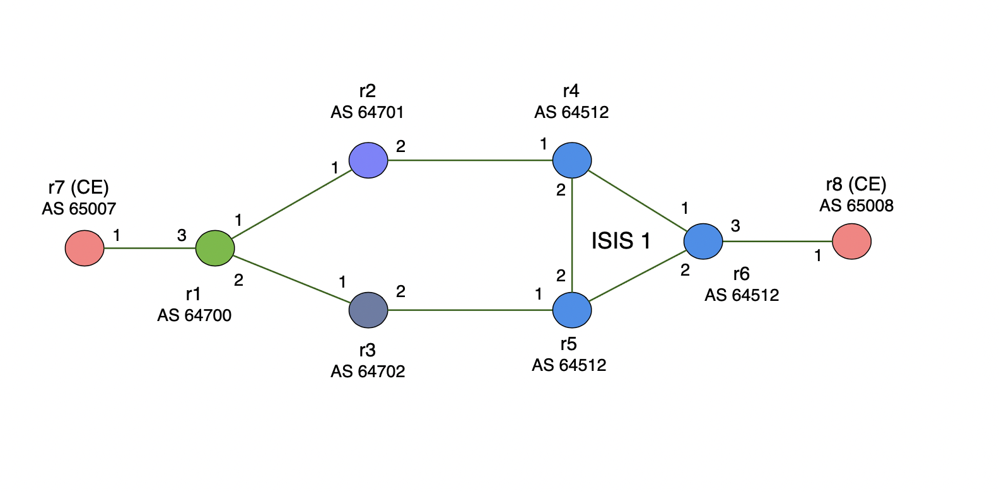

### An 8-node SRv6 lab using FRR
Many thanks to Brian Linkletter as his blog post gave this lab a jumpstart: 
https://www.brianlinkletter.com/2021/05/use-containerlab-to-emulate-open-source-routers/

```
sudo containerlab deploy -t frr.yml
```

### Topology


r1, r2, and r3 are eBGP peers with one another
r4, r5, and r6 run ISIS and are in ASN 64512
r2 and r4 are eBGP peers
r3 and r5 are eBGP peers
r7 is a CE node with r1 as its PE
r8 is a CE node with r6 as its PE

### FRR VRFs
VRFs must be added to FRR containers' underlying Linux per: https://docs.frrouting.org/en/latest/zebra.html#virtual-routing-and-forwarding

#### r1
```
ip link add blue type vrf table 10
ip link set dev blue up
ip link set dev eth3 master blue
ip addr add 2001:db8:3e8:7777::1/64 dev eth3
sysctl net.ipv4.ip_forward=1
sysctl net.ipv6.conf.all.forwarding=1
```

#### r6
```
ip link add blue type vrf table 10
ip link set dev blue up
ip link set dev eth3 master blue
ip addr add 2001:db8:3e8:8888::1/64 dev eth3
sysctl net.ipv4.ip_forward=1
sysctl net.ipv6.conf.all.forwarding=1
```

#### all nodes
```
sysctl net.ipv4.ip_forward=1
sysctl net.ipv6.conf.all.forwarding=1
```

### Validate BGP ipv4 vpn

#### On r1
```
show bgp vrf blue ipv4 uni 10.8.1.0/24
```
```
r1# show bgp vrf blue ipv4 uni 10.8.1.0/24
BGP routing table entry for 10.8.1.0/24, version 3
Paths: (2 available, best #2, vrf blue)
  Advertised to non peer-group peers:
  10.7.1.2 2001:db8:3e8:7777::2
  Imported from 10.8.1.2:2:10.8.1.0/24
  64702 64512
    10.1.1.3 from 0.0.0.0 (10.7.1.1) vrf default(0) announce-nh-self
      Origin incomplete, valid, sourced, local
      Extended Community: RT:1:1
      Remote label: 1616
      Remote SID: fc00:0:6::
      Last update: Sun Sep 24 03:34:17 2023
  Imported from 10.8.1.2:2:10.8.1.0/24
  64701 64512
    10.1.1.1 from 0.0.0.0 (10.7.1.1) vrf default(0) announce-nh-self
      Origin incomplete, valid, sourced, local, best (Older Path)
      Extended Community: RT:1:1
      Remote label: 1616
      Remote SID: fc00:0:6::
      Last update: Sun Sep 24 03:34:17 2023
```

#### on r6
```
show bgp vrf blue ipv4 uni 10.7.1.0/24
```

```
r6# show bgp vrf blue ipv4 uni 10.7.1.0/24
BGP routing table entry for 10.7.1.0/24, version 4
Paths: (2 available, best #1, vrf blue)
  Advertised to non peer-group peers:
  10.8.1.2 2001:db8:3e8:8888::2
  Imported from 10.7.1.1:2:10.7.1.0/24
  64701 64700
    10.0.0.4 (metric 20) from 0.0.0.0 (10.8.1.2) vrf default(0) announce-nh-self
      Origin incomplete, localpref 100, valid, sourced, local, best (Router ID)
      Extended Community: RT:1:1
      Remote label: 1616
      Remote SID: fc00:0:1::
      Last update: Sun Sep 24 03:34:16 2023
  Imported from 10.7.1.1:2:10.7.1.0/24
  64702 64700
    10.0.0.5 (metric 20) from 0.0.0.0 (10.8.1.2) vrf default(0) announce-nh-self
      Origin incomplete, localpref 100, valid, sourced, local
      Extended Community: RT:1:1
      Remote label: 1616
      Remote SID: fc00:0:1::
      Last update: Sun Sep 24 03:34:16 2023
```

### validate PE l3vpn routes in Linux
#### on r1
```
brmcdoug@naja:~$ docker exec -it clab-frr-frr-1 bash
r1:/# 
r1:/# 
r1:/# 
r1:/# ip route show vrf blue
10.7.0.1 via 10.7.1.2 dev eth3 proto bgp metric 20 
10.7.1.0/24 dev eth3 proto kernel scope link src 10.7.1.1 
10.8.1.0/24  encap seg6 mode encap segs 1 [ fc00:0:6:65:: ] via 10.1.1.1 dev eth1 proto bgp metric 20 
r1:/# 
```

#### on r6
```
brmcdoug@naja:~/srv6-labs/containerlab/frr$ docker exec -it clab-frr-frr-6 bash
r6:/# ip route show vrf blue
10.7.1.0/24  encap seg6 mode encap segs 1 [ fc00:0:1:65:: ] via 10.1.1.10 dev eth1 proto bgp metric 20 
10.8.0.1 via 10.8.1.2 dev eth3 proto bgp metric 20 
10.8.1.0/24 dev eth3 proto kernel scope link src 10.8.1.1 
r6:/# 
```

### tcpdump
Enter container netns to run tcpdump
```
sudo ip netns exec clab-frr-frr-1 tcpdump -ni eth2
```

